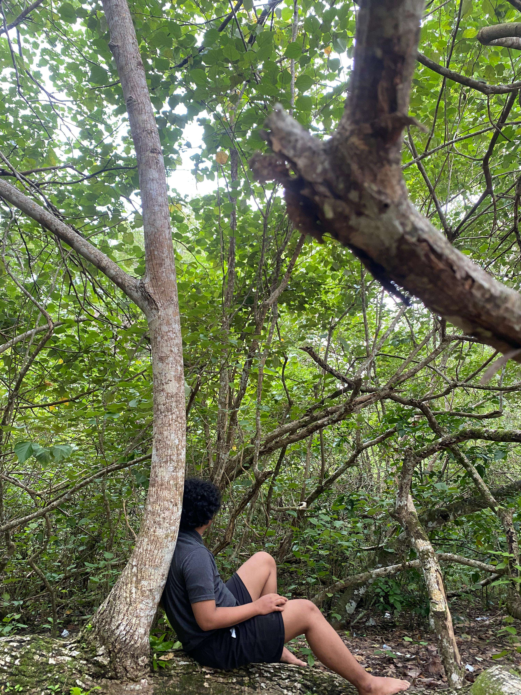

# 📱 Biodata Flutter

Aplikasi **Biodata Flutter** adalah aplikasi berbasis Flutter untuk menampilkan dan mengelola data diri (biodata) pengguna.

---

## 📸 Preview Aplikasi

### 👤 Halaman Profile


---

## 📖 Daftar Isi

- [Tentang Proyek](#-tentang-proyek)
- [Fitur](#-fitur)
- [Struktur Proyek](#-struktur-proyek)
- [Instalasi](#-instalasi)
- [Cara Menjalankan](#-cara-menjalankan)
- [Dependencies](#-dependencies)
- [Kontributor](#-kontributor)
- [Lisensi](#-lisensi)

---

## 📌 Tentang Proyek

Proyek ini dibuat menggunakan **Flutter** dan dapat dijalankan di Android, iOS, dan Web.

Aplikasi ini dapat dikembangkan menjadi:
- CV Digital
- Form Biodata
- Aplikasi Profil Pribadi

---

## ✨ Fitur

- Input data diri
- Tampilan profil
- UI sederhana dan responsif
- Multi-platform support

---

## 📂 Struktur Proyek

```bash
biodata_flutter/
│
├── assets/
│   └── images/
│       └── profile.jpg
│
├── lib/
│   └── main.dart
│
├── pubspec.yaml
└── README.md
```

---

## ⚙ Instalasi

```bash
git clone https://github.com/GapsMyers/biodata_flutter.git
cd biodata_flutter
flutter pub get
```

---

## ▶ Cara Menjalankan

```bash
flutter run
```

---

## 📦 Dependencies

- flutter
- cupertino_icons

Tambahkan package sesuai kebutuhan di `pubspec.yaml`.

---

## 🔧 Konfigurasi Assets

Pastikan `pubspec.yaml` sudah menambahkan:

```yaml
flutter:
  assets:
    - assets/images/profile.jpg
```

Atau jika ingin otomatis semua gambar:

```yaml
flutter:
  assets:
    - assets/images/
```

---

## 👨‍💻 Kontributor

- GapsMyers

---

## 📄 Lisensi

Gunakan lisensi sesuai kebutuhan (MIT/Apache 2.0/dll).
